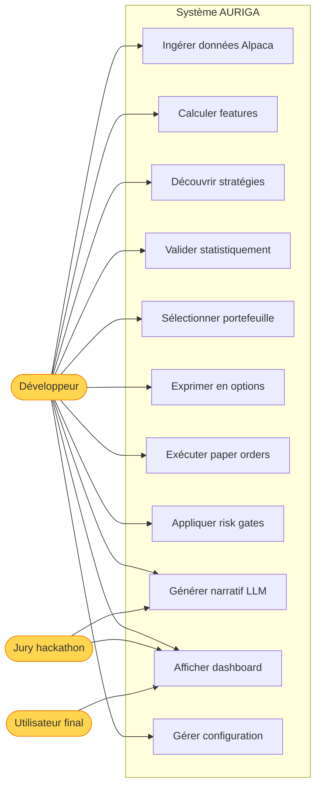
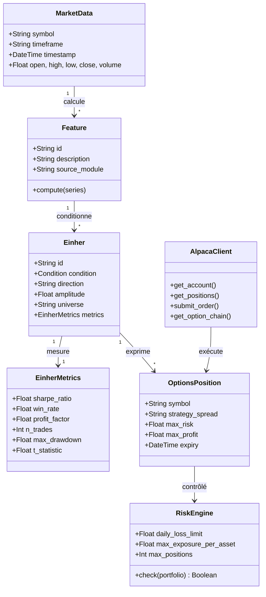
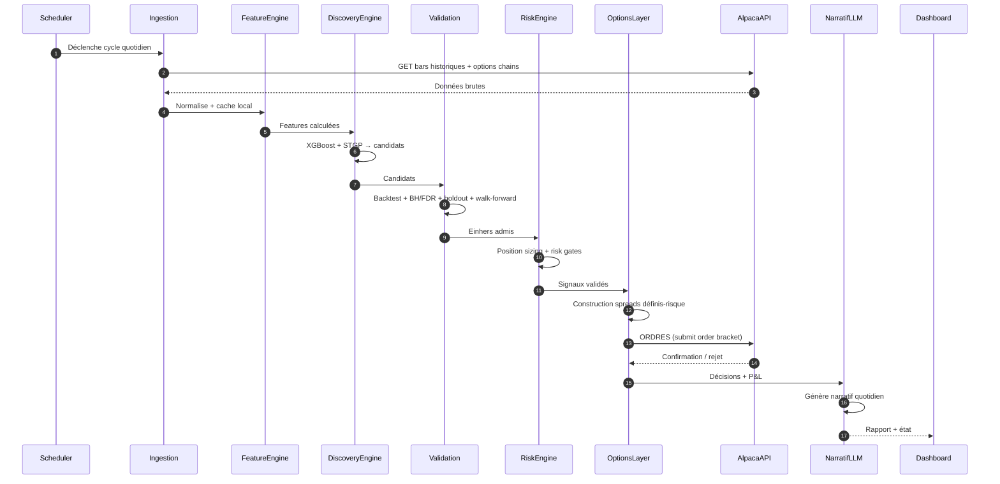
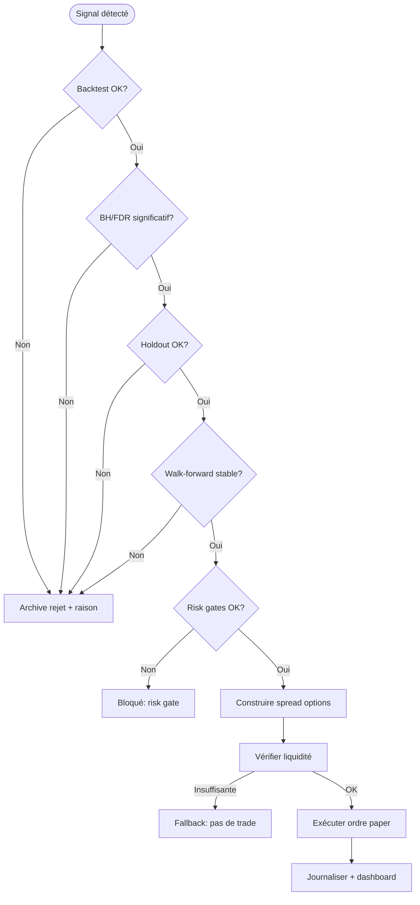
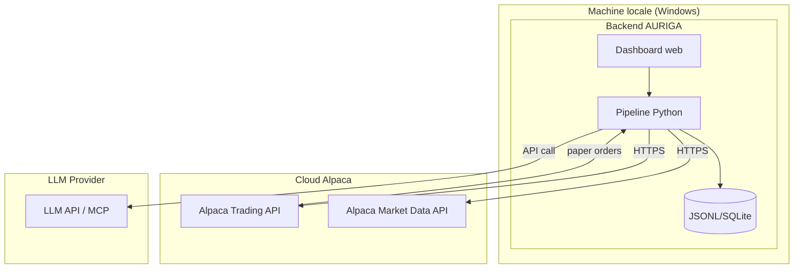

# AURIGA — CAHIER DES CHARGES LOGICIEL
## Software Requirements Specification (SRS) — conforme ISO/IEC/IEEE 29148:2018

| Champ | Valeur |
|---|---|
| **Projet** | AURIGA — Autonomous Quant Research & Investment Agent |
| **Version du document** | 0.1 (Brouillon) |
| **Date** | 02/09/2026 |
| **Statut** | Brouillon |
| **Auteur** | Jovanny (produit avec l'assistance d'Hermes Agent) |
| **Organisation** | Indépendant (hackathon Alpaca AI Trading Agents 2026) |
| **Norme de référence** | ISO/IEC/IEEE 29148:2018 — Systems and software engineering — Life cycle processes — Requirements engineering |
| **Méthodologie UML** | UML 2.5.1 (OMG 2017), rendu Mermaid |
| **Documents liés** | RECHERCHE_XGBOOST_DIVERSITE_1D_5M.md (einherjar), docs/PLAN_TECHNIQUES_RECHERCHE_FEATURES.md, technical_indicators.py & quantitative_features.py (midasV3), search_engine/ (einherjar) |

---

## TABLE DES MATIÈRES

1. Introduction
2. Description globale
3. Exigences spécifiques
4. Annexes

---

# PARTIE I — INTRODUCTION

## 1.1 But du document

Ce document spécifie les exigences fonctionnelles, techniques, de performance et non fonctionnelles du système **AURIGA** : un agent autonome de recherche quantitative et de trading qui découvre des stratégies de trading exploitables à partir de données de marché, les valide statistiquement, les déploie sur un compte paper-trading Alpaca (avec options définies-risque), et produit un narratif quotidien explicable de ses décisions.

**Audiences cibles** :
- Équipe de développement (Jovanny + Hermes Agent)
- Jury du hackathon Alpaca AI Trading Agents 2026 (évaluation P&L + créativité)
- Utilisateurs finaux potentiels (investisseurs quantitatifs)

## 1.2 Portée du produit

### 1.2.1 Dans le périmètre

Le système AURIGA doit :
- **F-01** : Ingérer des données de marché historiques (bars quotidiennes/intraday) pour un univers de 20-30 large caps liquides avec options via l'API Alpaca
- **F-02** : Calculer des features techniques et quantitatives à partir des données brutes (réutilisant les méthodes de calcul de midasV3 : RSI, MACD, volatilité réalisée, Hurst, entropies, etc.)
- **F-03** : Découvrir des stratégies de trading (Einhers) via un moteur hybride XGBoost + Programmation Génétique (STGP), chacune étant une règle explicable (conditions, direction, amplitude)
- **F-04** : Backtester les stratégies découvertes sur données historiques avec admission statistique (BH/FDR + holdout + walk-forward)
- **F-05** : Exécuter les stratégies validées sur un compte paper-trading Alpaca (capital simulé $100,000) via ordres d'options définis-risque (spreads)
- **F-06** : Appliquer des risk gates dures (position sizing, max drawdown, exposure sectorielle, daily loss limit)
- **F-07** : Produire un narratif quotidien généré par LLM (décisions, règles actives, P&L, justifications)
- **F-08** : Fournir un dashboard web (Streamlit/React) de suivi du portefeuille, des positions, du P&L et des règles actives

### 1.2.2 Hors périmètre

Le système AURIGA ne doit PAS :
- Trader en argent réel (paper trading uniquement pour le hackathon)
- Fournir des conseils financiers personnalisés
- Garantir des rendements ou promettre des gains
- Utiliser de l'IA générative pour les décisions de trading finales (les décisions sont validées par le moteur déterministe)
- Traiter les données à haute fréquence (< 1 minute) — alimentation quotidienne/intraday
- Couvrir toutes les classes d'actifs (actions/ETF uniquement pour le MVP)

### 1.2.3 Phasage

| Version | Périmètre | Cible |
|---|---|---|
| V1 (MVP hackathon) | Research → backtest → exécution paper + options → dashboard → narratif | 4 septembre 2026 (deadline hackathon) |
| V2 | Univers élargi, plus de familles de features, optimisation du portefeuille, mode live | Post-hackathon |
| V3 | Multi-compte, gestion de risque avancée, backtest de bout en bout en production | Long terme |

## 1.3 Définitions, acronymes, abréviations

(Voir Annexe E pour le glossaire complet)

| Acronyme | Définition |
|---|---|
| Einher | Stratégie de trading définie par : (1) condition de déclenchement, (2) direction, (3) amplitude, (4) univers, (5) métriques (win rate, Sharpe, CAGR, maxDD) |
| STGP | Strongly Typed Genetic Programming — programmation génétique typée |
| XGB | eXtreme Gradient Boosting — modèle de gradient boosting sur arbres |
| BH/FDR | Benjamini-Hochberg / False Discovery Rate — contrôle du taux de fausses découvertes |
| WRAcc | Weighted Relative Accuracy — mesure de qualité de sous-groupe |
| Sharpe | Ratio de Sharpe — rendement ajusté du risque |
| CAGR | Compound Annual Growth Rate |
| maxDD | Maximum Drawdown — perte maximale depuis un pic |
| Alpaca | Broker-dealer API : Trading API, Market Data API, MCP server, CLI |
| Paper trading | Simulation d'exécution avec capital fictif |
| Risk gate | Contrôle dur de risque appliqué avant toute décision d'exécution |

## 1.4 Références

| # | Référence | Date | Usage |
|---|---|---|---|
| R1 | ISO/IEC/IEEE 29148:2018 | 2018 | Norme SRS |
| R2 | UML 2.5.1 specification (OMG) | 2017 | Notation UML |
| R3 | Doc Alpaca Trading API | 2026 | Intégration broker |
| R4 | Doc Alpaca MCP Server | 2026 | Interface agent LLM |
| R5 | Alpaca AI Trading Agents Hackathon règles | 2026 | Contraintes du concours |
| R6 | RECHERCHE_XGBOOST_DIVERSITE_1D_5M.md (einherjar) | 2026 | Recherche préalable |
| R7 | technical_indicators.py, quantitative_features.py (midasV3) | 2026 | Méthodes de calcul de features |
| R8 | search_engine/ (einherjar) | 2026 | Moteur STGP existant |

## 1.5 Vue d'ensemble du document

- **Partie I — Introduction** : contexte, périmètre, définitions, références, risques
- **Partie II — Description globale** : perspective produit, fonctions, utilisateurs, contraintes, hypothèses, phasage
- **Partie III — Exigences spécifiques** : interfaces, fonctionnelles détaillées par module, performance, base de données, non fonctionnelles, IA/éthique
- **Partie IV — Annexes** : diagrammes UML, cas d'utilisation détaillés, modèle de données, RTM, glossaire, index

## 1.6 Analyse de risques (résumé)

| ID | Risque | Probabilité | Impact | Mitigation |
|---|---|---|---|---|
| RSK-001 | Deadline hackathon (4 sept) trop serrée pour tout implémenter | H | H | Priorisation stricte du MVP, réutilisation maximale d'einherjar/midasV3, code modulaire embarquable |
| RSK-002 | Données Alpaca insuffisantes pour features lourdes (entropies, DFA) | M | M | Features légères (RSI/MACD/volatilité) comme fallback, calcul incremental |
| RSK-003 | Ordres options rejetés (liquidité, prix) | M | M | Sélection d'options liquides, spreads définis-risque, fallback marché |
| RSK-004 | Overfitting des stratégies sur backtest | M | H | Admission statistique stricte (BH/FDR + holdout + walk-forward), taille minimale d'échantillon |
| RSK-005 | Erreurs API Alpaca (rate limits, outages) | M | M | Retirement robuste avec backoff, réessai, mode dégradé sans trading |
| RSK-006 | P&L du paper trading défavorable (bruit 7 jours) | H | M | Narratif explicatif, risk gates, diversité de stratégies, critère créativité comme levier |
| RSK-007 | Secret API exposé | M | H | Variables d'environnement, jamais dans le code/chat, .gitignore |

---

# PARTIE II — DESCRIPTION GLOBALE

## 2.1 Perspective produit

**AURIGA** est un système autonome de recherche quantitative et de trading, conçu pour le hackathon Alpaca AI Trading Agents 2026, qui capitalise sur trois briques préexistantes :

1. **midasV3** : fournit les méthodes de calcul de features techniques/quantitatives (Numba, batch) — ~50 fonctions récupérables telles quelles.
2. **einherjar/search_engine** : moteur complet de découverte de stratégies (STGP + MAP-Elites + bootstrap + DSR + admission + threshold_pool) — déjà implémenté, réutilisable.
3. **einherjar/xgb_einhers** : pipeline XGBoost → arbres → règles explicables, avec backtester, admission, walk-forward, twin clustering — déjà implémenté, réutilisable.

AURIGA les relie à **Alpaca** (données marché + exécution options paper) et ajoute **l'orchestration agentique LLM hybride** + **dashboard** + **narratif quotidien**.

```
MARKET DATA (Alpaca API)
        │
        ▼
FEATURE ENGINE (midasV3 methods : technical + quantitative)
        │
        ▼
DISCOVERY ENGINE (XGBoost arbres → règles + STGP / MAP-Elites)
        │
        ▼
VALIDATION (BH/FDR + holdout + walk-forward + DSR)
        │
        ▼
SELECTION & PORTFOLIO (MMR diversité, position sizing, risk gates)
        │
        ▼
OPTIONS EXPRESSION (spreads définis-risque : call/put spreads, credit spreads)
        │
        ▼
EXECUTION (alpaca-py paper account $100k)
        │
        ▼
MONITORING & NARRATIVE (dashboard web + rapport LLM quotidien)
```

## 2.2 Fonctions principales

- **F-01** : Ingestion de données marché Alpaca (bars + chaînes d'options)
- **F-02** : Feature engineering (technical + quantitative)
- **F-03** : Découverte de stratégies (XGBoost + STGP hybrides)
- **F-04** : Validation statistique (admission, robustesse)
- **F-05** : Sélection de portefeuille et position sizing
- **F-06** : Expression des signaux en options définis-risque
- **F-07** : Exécution paper Alpaca ($100k)
- **F-08** : Monitoring, risk gates et P&L temps réel
- **F-09** : Génération du narratif quotidien (LLM hybride)
- **F-10** : Dashboard web de suivi

## 2.3 Classes d'utilisateurs et caractéristiques

| Rôle | Description | Compétences | Fréquence | Fonctions accessibles |
|---|---|---|---|---|
| Développeur (Jovanny) | Configure, lance, itère sur le système | Avancé (Python, ML, quant) | Quotidienne | Toutes (CLI, config, debug) |
| Jury hackathon | Évalue le système via le dashboard et la soumission | Technique (quant/IA) | Ponctuelle | Dashboard, narratif, write-up |
| Utilisateur final (potentiel) | Consulte les performances et les stratégies actives | Intermédiaire | Quotidienne | Dashboard lecture seule |

## 2.4 Contraintes d'environnement opérationnel

| Contrainte | Détail |
|---|---|
| OS | Windows (machine locale de Jovanny) |
| Runtime | Python 3.11+ (coexistence avec venvs midas/einherjar) |
| Backend | alpaca-py (Trading + Market Data API) |
| Base de données | JSONL (corpus/archive, comme einherjar) + SQLite optionnel pour l'état de trading |
| API Alpaca | Paper trading, rate limits respectés (retry/backoff) |
| Hosting | Local (démo) — pas de déploiement cloud requis pour le MVP |

## 2.5 Contraintes de conception et d'implémentation

| ID | Contrainte | Justification |
|---|---|---|
| C-CON-001 | Réutiliser les méthodes de calcul de features de midasV3 (pas les .npy) | Les données Alpaca sont nouvelles ; seule la LOGIQUE de calcul est portable |
| C-CON-002 | Réutiliser search_engine (STGP + MAP-Elites) et xgb_einhers tels quels | Évite de réécrire l'existant, gagne du temps (deadline) |
| C-CON-003 | Aucun secret API dans le code source | Sécurité ; var d'environnement uniquement |
| C-CON-004 | Décisions de trading finales déterministes (pas de LLM) | Risk gates crédibles, reproductibilité |
| C-CON-005 | Options : spreads définis-risque uniquement | Mitigation risque, alignement règles hackathon |
| C-CON-006 | Admission statistique stricte avant tout trade live | Évite l'overfitting et le bruit |
| C-CON-007 | Langage : Python exclusivement (libs numériques) | Cohérence avec l'existant |

## 2.6 Hypothèses et dépendances

| ID | Hypothèse | Risque si fausse |
|---|---|---|
| HYP-001 | L'API Alpaca fournit des bars historiques suffisantes (≥2 ans) pour les large caps | Features limitées, admission impossible |
| HYP-002 | Les options des large caps sélectionnées sont suffisamment liquides | Spreads larges, exécution dégradée |
| HYP-003 | La logique de calcul de features midasV3 est portable sans les dépendances lourdes de midasV3 | Réécriture nécessaire |
| HYP-004 | search_engine et xgb_einhers s'exécutent dans un venv Python coexistable | Migration de l'environnement |

**Dépendances externes critiques** :
- Alpaca Trading API + Market Data API (paper)
- Compte paper dédié hackathon ($100k)
- Python 3.11+, numpy, polars, numba, xgboost, alpaca-py, streamlit/React

## 2.7 Répartition des exigences (V1 / V2 / V3)

- **V1 (MVP)** : boucle fermée complète research → signaux → paper orders options → dashboard + narratif. Univers 20-30 large caps. Features techniques + quantitatives de base. Moteur XGBoost + STGP (admission commune).
- **V2** : univers élargi, optimisation de portefeuille, multi-actifs, mode live réel, backtesting avancé.
- **V3** : multi-compte, gestion de risque institutionnelle, serveur de production, IA plus autonome.

---

# PARTIE III — EXIGENCES SPÉCIFIQUES

## 3.1 Exigences d'interfaces externes

### 3.1.1 Interfaces utilisateur

| ID | Exigence | Priorité | Vérification |
|---|---|---|---|
| REQ-IF-U-001 | Le système doit fournir un dashboard web (Streamlit ou React/Vite) affichant : P&L temps réel, positions ouvertes, règles actives, historique des décisions | H | Démo |
| REQ-IF-U-002 | Le dashboard doit afficher le narratif quotidien généré par LLM (décisions, justifications) | H | Démo |
| REQ-IF-U-003 | Le dashboard doit permettre de consulter les métriques de chaque stratégie active (Sharpe, win rate, PF, maxDD, nombre de trades) | M | Démo |
| REQ-IF-U-004 | Le dashboard doit afficher les risk gates actifs et les alertes (daily loss limit, max exposure) | M | Démo |
| REQ-IF-U-005 | L'interface CLI doit permettre de lancer le pipeline complet en une commande | H | Test |

### 3.1.2 Interfaces logicielles (APIs tierces)

| ID | Exigence | Priorité | Vérification |
|---|---|---|---|
| REQ-IF-S-001 | Le système doit s'intégrer à l'API Trading Alpaca pour : compte, positions, ordres, watchlists | H | Test d'intégration |
| REQ-IF-S-002 | Le système doit s'intégrer à l'API Market Data Alpaca pour : bars historiques (actions), chaînes d'options | H | Test d'intégration |
| REQ-IF-S-003 | Le système doit utiliser le SDK alpaca-py (client officiel) plutôt que des appels HTTP bruts | H | Inspection |
| REQ-IF-S-004 | Le système doit gérer les rate limits Alpaca (retry avec backoff exponentiel, jitter) | H | Test de charge |

### 3.1.3 Interfaces de communication

| ID | Exigence | Priorité |
|---|---|---|
| REQ-IF-C-001 | Les appels API Alpaca doivent respecter les limites de taux (429 géré par backoff) | H |
| REQ-IF-C-002 | Les erreurs API doivent être journalisées avec contexte (endpoint, code, message) | H |
| REQ-IF-C-003 | Le système doit fonctionner en mode dégradé si l'API Alpaca est indisponible (pas d'ordres, recherche seulement) | M |

### 3.1.4 Interfaces de données

| ID | Exigence | Priorité |
|---|---|---|
| REQ-IF-D-001 | Les données de marché entrants doivent être normalisées (symboles, timeframes, timezone UTC) | H |
| REQ-IF-D-002 | Les stratégies découvertes et leurs métriques doivent être persistées en JSONL (corpus + archive) | H |
| REQ-IF-D-003 | L'état de trading (positions, ordres, P&L) doit être journalisé pour traçabilité | H |
| REQ-IF-D-004 | Le narratif quotidien doit être horodaté et versionné | M |

## 3.2 Exigences fonctionnelles

### 3.2.1 Module ING (Ingestion de données)

| ID | Exigence | Acteur | Priorité | Vérification |
|---|---|---|---|---|
| REQ-F-ING-001 | Le système doit télécharger les bars historiques quotidiennes (≥2 ans) pour les 20-30 large caps de l'univers via l'API Market Data Alpaca | Système | H | Test |
| REQ-F-ING-002 | Le système doit télécharger les chaînes d'options (calls/puts, strikes, expirations) pour les actifs de l'univers | Système | H | Test |
| REQ-F-ING-003 | Le système doit organiser les données en cache local (parquet/JSONL) pour éviter les re-téléchargements | Système | M | Test |
| REQ-F-ING-004 | Le système doit nettoyer les données (NaN, outliers, splits/dividendes ajustés) | Système | H | Test |
| REQ-F-ING-005 | Le système doit détecter et signaler les gaps de données (jours manquants) | Système | M | Test |

### 3.2.2 Module FEAT (Feature Engineering)

| ID | Exigence | Acteur | Priorité | Vérification |
|---|---|---|---|---|
| REQ-F-FEAT-001 | Le système doit calculer les features techniques de base (RSI, MACD, SMA, EMA, Bollinger, ATR, volume) via les méthodes midasV3 portées | Système | H | Test (comparaison valeurs connues) |
| REQ-F-FEAT-002 | Le système doit calculer les features quantitatives avancées (volatilité réalisée, Hurst, entropies, DFA, skewness, kurtosis, VaR, CVaR, maxDD, détection de régime) via les méthodes midasV3 portées | Système | M | Test |
| REQ-F-FEAT-003 | Le système doit gérer les fenêtres glissantes de calcul (lookback configurable) sans fuite de données future | Système | H | Test (pas de lookahead) |
| REQ-F-FEAT-004 | Chaque feature doit porter un identifiant unique et une description (traçabilité jusqu'au code de calcul) | Système | H | Inspection |
| REQ-F-FEAT-005 | Les features doivent être normalisées/standardisées avant ingestion dans les moteurs | Système | M | Test |
| REQ-F-FEAT-006 | En cas de données insuffisantes pour une feature lourde, le système doit la désactiver proprement (fallback) | Système | M | Test |

### 3.2.3 Module DISC (Découverte de stratégies)

| ID | Exigence | Acteur | Priorité | Vérification |
|---|---|---|---|---|
| REQ-F-DISC-001 | Le système doit découvrir des stratégies explicables (Einhers) via XGBoost : entraîner un modèle, extraire les chemins d'arbres, transformer en règles | Système | H | Test |
| REQ-F-DISC-002 | Le système doit découvrir des stratégies via STGP (search_engine) : génération de population, MAP-Elites, crossover/mutation | Système | H | Test |
| REQ-F-DISC-003 | Les deux moteurs doivent partager le même format de sortie (Einher : conditions, direction, amplitude, univers, métriques) | Système | H | Test |
| REQ-F-DISC-004 | Le système doit contrôler la diversité (pas de doublons near-identical) via MMR ou clustering jumeaux | Système | M | Test |
| REQ-F-DISC-005 | Chaque Einher doit être traçable à sa source (XGBoost global / cross-family / family / STGP) | Système | H | Inspection |
| REQ-F-DISC-006 | La génération doit être bornée (nombre max de candidats par cycle) pour maîtriser le temps d'exécution | Système | H | Test |

### 3.2.4 Module VAL (Validation statistique)

| ID | Exigence | Acteur | Priorité | Vérification |
|---|---|---|---|---|
| REQ-F-VAL-001 | Le système doit backtester chaque candidat sur les données historiques avec coûts de transaction réalistes | Système | H | Test |
| REQ-F-VAL-002 | Le système doit appliquer l'admission statistique : seuils minimaux (Sharpe ≥ 2.0, win rate ≥ 0.65, PF ≥ 1.5, n_trades ≥ 30, maxDD ≤ 0.30) | Système | H | Test |
| REQ-F-VAL-003 | Le système doit appliquer un contrôle du taux de fausses découvertes (BH/FDR) adapté au volume de données | Système | H | Test |
| REQ-F-VAL-004 | Le système doit valider sur un holdout hors échantillon (minimum de trades) | Système | H | Test |
| REQ-F-VAL-005 | Le système doit appliquer une validation walk-forward (stabilité temporelle, ≥60% de folds rentables) | Système | M | Test |
| REQ-F-VAL-006 | Les candidats rejetés doivent être archivés AVEC leur raison de rejet (traçabilité) | Système | H | Test |
| REQ-F-VAL-007 | Les stratégies admises à un moment donné doivent pouvoir être re-validées périodiquement (drift check) | Système | M | Test |

### 3.2.5 Module SEL (Sélection et portefeuille)

| ID | Exigence | Acteur | Priorité | Vérification |
|---|---|---|---|---|
| REQ-F-SEL-001 | Le système doit sélectionner un portefeuille de stratégies diversifiées (pas de corrélation excessive entre règles actives) | Système | H | Test |
| REQ-F-SEL-002 | Le système doit allouer le capital aux stratégies selon un position sizing (Kelly-lite / vol-target, plafonné) | Système | H | Test |
| REQ-F-SEL-003 | Le système doit éviter la sur-exposition à un même actif ou secteur | Système | H | Test |
| REQ-F-SEL-004 | Le système doit définir un nombre max de positions simultanées (ex: 10-15) | Système | M | Test |
| REQ-F-SEL-005 | Le système doit rééquilibrer le portefeuille à fréquence définie (quotidienne/hebdo) | Système | M | Test |

### 3.2.6 Module OPT (Expression Options)

| ID | Exigence | Acteur | Priorité | Vérification |
|---|---|---|---|---|
| REQ-F-OPT-001 | Le système doit convertir chaque signal (direction + amplitude + confiance) en stratégie d'options définis-risque | Système | H | Test |
| REQ-F-OPT-002 | Pour un signal long : bull call spread ou put credit spread | Système | H | Test |
| REQ-F-OPT-003 | Pour un signal short : bear put spread ou call credit spread | Système | H | Test |
| REQ-F-OPT-004 | Le système doit sélectionner des strikes/expirations selon la liquidité (volume/Open interest minimum) | Système | H | Test |
| REQ-F-OPT-005 | Le système doit borner le risque par position (débit max / crédit max) | Système | H | Test |
| REQ-F-OPT-006 | Le système doit vérifier la liquidité de la chaîne avant ordre (bid-ask spread raisonnable) | Système | M | Test |
| REQ-F-OPT-007 | Le système doit journaliser la construction exacte de chaque spread (legs, prix, délta) | Système | M | Test |

### 3.2.7 Module EXEC (Exécution Alpaca)

| ID | Exigence | Acteur | Priorité | Vérification |
|---|---|---|---|---|
| REQ-F-EXEC-001 | Le système doit ouvrir des ordres (market/limit) sur le compte paper Alpaca via alpaca-py | Système | H | Test d'intégration |
| REQ-F-EXEC-002 | Le système doit gérer les ordres bracket (TP/SL) pour chaque position options | Système | H | Test |
| REQ-F-EXEC-003 | Le système doit fermer les positions à échéance (options) ou selon les règles stratégiques | Système | H | Test |
| REQ-F-EXEC-004 | Le système doit vérifier la disponibilité du capital avant chaque ordre (buying power) | Système | H | Test |
| REQ-F-EXEC-005 | Le système doit réessayer les ordres échoués avec backoff (rate limits, erreurs temporaires) | Système | H | Test |
| REQ-F-EXEC-006 | Le système doit journaliser chaque ordre (payload, réponse, statut) | Système | H | Test |

### 3.2.8 Module RSK (Risk Engine)

| ID | Exigence | Acteur | Priorité | Vérification |
|---|---|---|---|---|
| REQ-F-RSK-001 | Le système doit appliquer un stop global : daily loss limit (ex: -2% du compte) → arrêt des nouveaux ordres | Système | H | Test |
| REQ-F-RSK-002 | Le système doit appliquer un plafond d'exposition par actif (ex: 10% du compte) | Système | H | Test |
| REQ-F-RSK-003 | Le système doit appliquer un plafond d'exposition sectorielle | Système | M | Test |
| REQ-F-RSK-004 | Le système doit appliquer une limite de positions simultanées | Système | H | Test |
| REQ-F-RSK-005 | Le système doit appliquer une limite de risque total du portefeuille (VaR/CVaR cible) | Système | M | Test |
| REQ-F-RSK-006 | Chaque risk gate doit être vérifié AVANT exécution d'ordre, et journalisé quand il bloque | Système | H | Test |
| REQ-F-RSK-007 | En cas de dépassement d'un risk gate dur, le système doit pouvoir liquider des positions | Système | M | Test |

### 3.2.9 Module NAR (Narratif LLM)

| ID | Exigence | Acteur | Priorité | Vérification |
|---|---|---|---|---|
| REQ-F-NAR-001 | Le système doit générer un rapport quotidien en langage naturel résumant : découvertes, décisions, P&L, risk gates actifs | LLM | H | Démo |
| REQ-F-NAR-002 | Le narratif doit être ancré sur des faits (les décisions/trades réels, pas des généralités) | LLM | H | Inspection |
| REQ-F-NAR-003 | Le LLM peut PROPOSER des hypothèses de règles ou des ajustements de paramètres, mais ne peut PAS décider seul | LLM | H | Inspection |
| REQ-F-NAR-004 | Toute proposition du LLM qui touche au trading doit être validée par le moteur déterministe (backtest + admission) avant activation | LLM | H | Inspection |
| REQ-F-NAR-005 | Le narratif doit être versionné et horodaté | LLM | M | Test |
| REQ-F-NAR-006 | Le narratif doit être accessible dans le dashboard | LLM | H | Démo |

### 3.2.10 Module ORC (Orchestration & Scheduler)

| ID | Exigence | Acteur | Priorité | Vérification |
|---|---|---|---|---|
| REQ-F-ORC-001 | Le système doit exécuter un cycle complet (ingestion → features → découverte → validation → sélection → exécution) à fréquence configurable | Système | H | Test |
| REQ-F-ORC-002 | Le système doit journaliser chaque étape avec timing et statut | Système | H | Test |
| REQ-F-ORC-003 | Le système doit survivre aux erreurs d'une étape sans perdre les résultats précédents (reprise) | Système | H | Test |
| REQ-F-ORC-004 | Le système doit exposer une commande CLI unique pour lancer le pipeline | Système | H | Test |
| REQ-F-ORC-005 | Le système doit supporter le mode dégradé (recherche seule si API/risque indisponible) | Système | M | Test |

## 3.3 Exigences de performance

| ID | Exigence | Cible | Mesure |
|---|---|---|---|
| REQ-PERF-001 | Feature engineering pour 30 actifs × 2 ans de données quotidiennes | ≤ 5 min | Timestamp au log |
| REQ-PERF-002 | Découverte (XGBoost + STGP) pour un cycle | ≤ 15 min | Timestamp au log |
| REQ-PERF-003 | Backtest + admission d'un candidat | ≤ 1 s par candidat (batch) | Profiling |
| REQ-PERF-004 | Cycle complet (research → exécution) | ≤ 30 min | Timestamp au log |
| REQ-PERF-005 | Dashboard : chargement initial | ≤ 5 s | Mesure navigateur |
| REQ-PERF-006 | Nombre max de candidats générés par cycle | ≤ 1000 | Compteur |
| REQ-PERF-007 | Taille mémoire max du pipeline | ≤ 8 GB RAM | monitoring |
| REQ-PERF-008 | Réponse API Alpaca : respect des rate limits (pas de ban) | 100% des appels | Logs erreurs 429 |

## 3.4 Exigences de base de données logique

| ID | Exigence |
|---|---|
| REQ-DB-001 | Corpus des stratégies admises : JSONL (append-only, verrouillé inter-processus) |
| REQ-DB-002 | Archive des stratégies rejetées : JSONL avec raison de rejet |
| REQ-DB-003 | État de trading (positions, ordres, P&L) : JSONL ou SQLite |
| REQ-DB-004 | Narratifs quotidiens : fichiers Markdown horodatés |
| REQ-DB-005 | Cache des données marché : parquet/JSONL local |
| REQ-DB-006 | Chaque Entité doit être traçable (ID unique horodaté, source) |

## 3.5 Attributs du système logiciel (exigences non fonctionnelles)

### 3.5.1 Fiabilité

| ID | Exigence | Priorité |
|---|---|---|
| REQ-NF-REL-001 | Le système doit survivre aux pannes API (retries, backoff, mode dégradé) | H |
| REQ-NF-REL-002 | Les fichiers JSONL doivent être protégés contre l'écriture concurrente (verrous) | H |
| REQ-NF-REL-003 | Le système doit journaliser toutes les erreurs avec stack trace et contexte | H |

### 3.5.2 Disponibilité

| ID | Exigence | Priorité |
|---|---|---|
| REQ-NF-AVA-001 | Le pipeline doit être relançable à tout moment sans corruption (idempotent) | H |
| REQ-NF-AVA-002 | Le dashboard doit rester disponible même si le pipeline ne tourne pas | M |

### 3.5.3 Sécurité

| ID | Exigence | Priorité |
|---|---|---|
| REQ-NF-SEC-001 | Aucun secret API (clés Alpaca) ne doit apparaître dans le code, les logs, ou les artefacts | H |
| REQ-NF-SEC-002 | Les clés doivent être chargées depuis l'environnement (variables d'env) | H |
| REQ-NF-SEC-003 | Le fichier .env/.gitignore doit exclure tous les fichiers de secrets | H |
| REQ-NF-SEC-004 | Les ordres ne doivent jamais être exécutés en live avec les clés paper par erreur | H |

### 3.5.4 Maintenabilité

| ID | Exigence | Priorité |
|---|---|---|
| REQ-NF-MAI-001 | Chaque module doit être dans un fichier séparé, avec docstring et typage | H |
| REQ-NF-MAI-002 | La configuration (univers, seuils, horizons) doit être externalisée (fichier YAML/TOML) | M |
| REQ-NF-MAI-003 | Le code doit passer ruff (lint) sans erreur | M |
| REQ-NF-MAI-004 | Les fonctions de calcul de features doivent être documentées (source midasV3) | M |

### 3.5.5 Portabilité

| ID | Exigence | Priorité |
|---|---|---|
| REQ-NF-POR-001 | Le système doit fonctionner sur Windows (machine de dev) avec Python 3.11+ | H |
| REQ-NF-POR-002 | Les dépendances lourdes (numba, xgboost) doivent être optionnelles/fallback si absentes | M |

### 3.5.6 Ergonomie / UX

| ID | Exigence | Priorité |
|---|---|---|
| REQ-NF-UX-001 | Le dashboard doit être lisible en 1 minute par le jury (P&L, positions, règles actives visibles d'un coup d'œil) | H |
| REQ-NF-UX-002 | Le rapport quotidien doit être compréhensible par un non-quant | M |
| REQ-NF-UX-003 | Les alertes de risk gate doivent être visuellement claires | M |

## 3.6 Exigences d'IA, de ML et d'éthique

| ID | Exigence | Priorité |
|---|---|---|
| REQ-AI-001 | Le LLM ne doit jamais générer d'ordre de trading directement (toujours via le moteur déterministe) | H |
| REQ-AI-002 | Toute décision de trading doit être explicable (règle lisible, métriques, backtest) | H |
| REQ-AI-003 | Les modèles (XGBoost/STGP) doivent être versionnés et reproductibles (seed fixe, config loggée) | H |
| REQ-AI-004 | Le système doit documenter le risque de sur-ajustement et la limite du paper trading | M |
| REQ-AI-005 | Le système doit afficher un disclaimer : pas un conseil financier, pas une garantie de gains | H |
| REQ-AI-006 | Les propositions du LLM doivent être tracées (prompt, output, validation, acceptation/rejet) | M |
| REQ-AI-007 | Le système doit refuser d'exécuter un ordre si la validation statistique n'est pas satisfaite | H |
| REQ-AI-008 | Les features utilisées ne doivent pas inclure de variable interdite (fuite future) | H |

---

# PARTIE IV — ANNEXES

## Annexe A — Diagrammes UML

### A.1 Diagramme de cas d'utilisation général



### A.2 Diagramme de classes (domaine)



### A.3 Diagramme de séquence : [Cycle quotidien complet]



### A.4 Diagramme d'activité : [Workflow de décision d'un signal]



### A.5 Diagramme de déploiement



## Annexe B — Spécifications détaillées des cas d'utilisation

### B.1 UC-03 — Découvrir des stratégies

| Champ | Valeur |
|---|---|
| **ID** | UC-03 |
| **Nom** | Découvrir des stratégies (Einhers) |
| **Acteur primaire** | Système (scheduler) |
| **Acteurs secondaires** | FeatureEngine, Validation |
| **Préconditions** | (1) Features calculées et disponibles, (2) moteur configuré |
| **Postconditions** | (1) corpus.jsonl mis à jour, (2) archive.jsonl documente les rejets |
| **Niveau** | Objectif utilisateur |
| **Fréquence estimée** | Quotidienne |

**Scénario nominal (succès)** :
1. Le scheduler déclenche la découverte
2. Le système entraîne XGBoost sur les features
3. Le système extrait les chemins d'arbres en règles candidates
4. Le système génère une population STGP (MAP-Elites, crossover/mutation)
5. Les candidats des deux moteurs sont fusionnés et dédupés
6. Chaque candidat est backtesté
7. L'admission (BH/FDR + holdout + walk-forward) filtre les candidats
8. Les Einhers admis sont ajoutés au corpus, les rejets à l'archive

**Scénarios alternatifs** :
- **3a. Pas assez d'arbres exploitables** : fallback vers STGP seul
- **4a. Population STGP trop lente** : réduction de la taille de population

**Scénarios d'erreur** :
- **6a. Backtest échoue** (données manquantes) : candidat archivé avec raison "backtest_error"

**Exigences non fonctionnelles liées** :
- REQ-PERF-002, REQ-PERF-006

### B.2 UC-07 — Exécuter des ordres paper

| Champ | Valeur |
|---|---|
| **ID** | UC-07 |
| **Nom** | Exécuter des ordres paper Alpaca |
| **Acteur primaire** | RiskEngine (après validation) |
| **Acteurs secondaires** | OptionsLayer, Alpaca API |
| **Préconditions** | (1) Einhers admis, (2) risk gates vérifiés, (3) compte paper $100k |
| **Postconditions** | (1) Positions ouvertes ou rejetées, (2) état journalisé |
| **Niveau** | Objectif utilisateur |
| **Fréquence estimée** | Quotidienne |

**Scénario nominal (succès)** :
1. Le système sélectionne les signaux valides
2. Le système construit les spreads définis-risque
3. Le système vérifie la liquidité des options
4. Le système vérifie les risk gates (exposition, daily loss)
5. Le système soumet les ordres via alpaca-py
6. Le système confirme et journalise les positions

**Scénarios alternatifs** :
- **3a. Liquidité insuffisante** : annuler le signal, journaliser
- **4a. Risk gate bloqué** : annuler, alert

**Scénarios d'erreur** :
- **5a. Ordre rejeté par Alpaca** : réessai avec backoff (max 3), sinon annulation

**Exigences non fonctionnelles liées** :
- REQ-NF-SEC-00x, REQ-F-EXEC-00x

### B.3 UC-09 — Générer le narratif quotidien

| Champ | Valeur |
|---|---|
| **ID** | UC-09 |
| **Nom** | Générer le narratif quotidien |
| **Acteur primaire** | LLM (déclencheur scheduler) |
| **Acteurs secondaires** | Dashboard |
| **Préconditions** | (1) Cycle de trading terminé, (2) décisions journalisées |
| **Postconditions** | (1) Rapport Markdown horodaté, (2) accessible dashboard |
| **Niveau** | Objectif utilisateur |
| **Fréquence estimée** | Quotidienne |

**Scénario nominal (succès)** :
1. Le scheduler collecte les faits du jour (P&L, positions, découvertes, risk gates)
2. Le LLM rédige un rapport en langage naturel, ancré sur ces faits
3. Le rapport est versionné et affiché au dashboard

**Scénarios alternatifs** :
- **2a. LLM indisponible** : fallback sur un template factuel

**Scénarios d'erreur** :
- **2b. Hallucination détectée** : le rapport doit citer uniquement des faits vérifiés (les chiffres viennent du moteur, pas du LLM)

**Exigences non fonctionnelles liées** :
- REQ-AI-001 à REQ-AI-008

## Annexe C — Modèle de données

```prisma
// Schéma Prisma équivalent (stockage réel : JSONL/parquet)

model MarketData {
  id        String   @id
  symbol    String
  timeframe String
  timestamp DateTime
  open      Float
  high      Float
  low       Float
  close     Float
  volume    Int
}

model Feature {
  id            String  @id
  description   String
  source_module String
}

model Einher {
  id          String  @id
  condition   Json    // Condition tree (AND/OR d'atomes)
  direction   String
  amplitude   Float
  universe    String
  source      String  // XGBoost global/cross/family/STGP
  metrics     EinherMetrics
  admittedAt  DateTime
}

model EinherMetrics {
  id            String  @id
  sharpe_ratio  Float
  win_rate      Float
  profit_factor Float
  n_trades      Int
  max_drawdown  Float
  t_statistic   Float
}

model OptionsPosition {
  id            String  @id
  symbol        String
  strategy      String  // bull_call_spread, put_credit_spread, etc.
  max_risk      Float
  max_profit    Float
  expiry        DateTime
  einherId      String
}

model RiskEvent {
  id        String  @id
  gate      String
  action    String  // blocked, liquidated, alerted
  timestamp DateTime
  detail    String
}

model NarrativeReport {
  id        String  @id
  date      DateTime
  content   String
  version   Int
}
```

## Annexe D — Matrice de traçabilité des exigences (RTM)

| ID | Description | Priorité | UC | Test | Statut |
|---|---|---|---|---|---|
| REQ-F-ING-001 | Ingestion bars historiques Alpaca | H | UC-01 | TA-ING-01 | À tester |
| REQ-F-ING-002 | Ingestion chaînes d'options | H | UC-01 | TA-ING-02 | À tester |
| REQ-F-FEAT-001 | Features techniques (RSI, MACD, etc.) | H | UC-02 | TA-FEAT-01 | À tester |
| REQ-F-FEAT-002 | Features quantitatives (Hurst, DFA, etc.) | M | UC-02 | TA-FEAT-02 | À tester |
| REQ-F-DISC-001 | Découverte XGBoost → règles | H | UC-03 | TA-DISC-01 | À tester |
| REQ-F-DISC-002 | Découverte STGP (search_engine) | H | UC-03 | TA-DISC-02 | À tester |
| REQ-F-VAL-001 | Backtest avec coûts réels | H | UC-04 | TA-VAL-01 | À tester |
| REQ-F-VAL-002 | Admission statistique (seuils) | H | UC-04 | TA-VAL-02 | À tester |
| REQ-F-VAL-003 | BH/FDR adaptatif | H | UC-04 | TA-VAL-03 | À tester |
| REQ-F-VAL-004 | Holdout hors échantillon | H | UC-04 | TA-VAL-04 | À tester |
| REQ-F-VAL-005 | Walk-forward | M | UC-04 | TA-VAL-05 | À tester |
| REQ-F-SEL-001 | Sélection portefeuille diversifié | H | UC-05 | TA-SEL-01 | À tester |
| REQ-F-OPT-001 | Conversion signal → spread options | H | UC-06 | TA-OPT-01 | À tester |
| REQ-F-EXEC-001 | Ordres paper Alpaca | H | UC-07 | TA-EXEC-01 | À tester |
| REQ-F-RSK-001 | Daily loss limit | H | UC-08 | TA-RSK-01 | À tester |
| REQ-F-NAR-001 | Narratif quotidien LLM | H | UC-09 | TA-NAR-01 | À tester |
| REQ-F-ORC-001 | Cycle complet orchestré | H | UC-10 | TA-ORC-01 | À tester |
| REQ-PERF-002 | Découverte ≤ 15 min | H | UC-03 | TP-ORC-02 | À tester |
| REQ-AI-001 | Pas d'ordre direct par le LLM | H | UC-09 | TAI-AI-01 | À tester |
| REQ-NF-SEC-001 | Aucun secret dans le code | H | — | TS-SEC-01 | À tester |

## Annexe E — Glossaire

### E.1 Termes métier

- **Einher** : stratégie de trading définie par condition de déclenchement, direction, amplitude, univers et métriques.
- **Spread défini-risque** : stratégie d'options dont la perte maximale est bornée (bull call spread, put credit spread, etc.).
- **Paper trading** : exécution simulée sur un compte à capital fictif.
- **Risk gate** : contrôle dur de risque appliqué avant toute décision d'exécution.
- **Signal** : déclenchement d'une règle stratégique sur les données actuelles.

### E.2 Termes techniques

- **BH/FDR** : Benjamini-Hochberg / False Discovery Rate — contrôle du taux de fausses découvertes.
- **STGP** : Strongly Typed Genetic Programming — programmation génétique typée.
- **XGBoost** : eXtreme Gradient Boosting — modèle de gradient boosting sur arbres.
- **WRAcc** : Weighted Relative Accuracy — mesure de qualité de sous-groupe.
- **MAP-Elites** : algorithme d'archive multidimensionnelle de solutions élites.
- **DSR** : Deflated Sharpe Ratio — ratio de Sharpe dégonflé.
- **Walk-forward** : validation temporelle en fenêtres glissantes.
- **MMR** : Maximal Marginal Relevance — sélection maximisant la diversité.
- **CAGR** : Compound Annual Growth Rate.
- **maxDD** : Maximum Drawdown.
- **VaR/CVaR** : Value at Risk / Conditional Value at Risk.

## Annexe F — Index des exigences

| Catégorie | Préfixe | Nombre |
|---|---|---|
| Interfaces utilisateur | REQ-IF-U | 5 |
| Interfaces logicielles | REQ-IF-S | 4 |
| Interfaces communication | REQ-IF-C | 3 |
| Interfaces données | REQ-IF-D | 4 |
| Fonctionnelles Ingestion | REQ-F-ING | 5 |
| Fonctionnelles Feature | REQ-F-FEAT | 6 |
| Fonctionnelles Découverte | REQ-F-DISC | 6 |
| Fonctionnelles Validation | REQ-F-VAL | 7 |
| Fonctionnelles Sélection | REQ-F-SEL | 5 |
| Fonctionnelles Options | REQ-F-OPT | 7 |
| Fonctionnelles Exécution | REQ-F-EXEC | 6 |
| Fonctionnelles Risque | REQ-F-RSK | 7 |
| Fonctionnelles Narratif | REQ-F-NAR | 6 |
| Fonctionnelles Orchestration | REQ-F-ORC | 5 |
| Performance | REQ-PERF | 8 |
| Base de données | REQ-DB | 6 |
| NF Fiabilité | REQ-NF-REL | 3 |
| NF Disponibilité | REQ-NF-AVA | 2 |
| NF Sécurité | REQ-NF-SEC | 4 |
| NF Maintenabilité | REQ-NF-MAI | 4 |
| NF Portabilité | REQ-NF-POR | 2 |
| NF UX | REQ-NF-UX | 3 |
| IA / Éthique | REQ-AI | 8 |
| **TOTAL** | | **116** |

---

## FIN DU DOCUMENT

**Statut** : À valider
**Prochaines étapes** :
1. Valider les 4 décisions structurantes (nom, LLM hybride, moteurs XGBoost+GP, options paper)
2. Valider l'univers de 20-30 large caps
3. Créer le compte paper Alpaca + clés API
4. Initialiser le dépôt git du projet AURIGA
5. Implémenter les modules dans l'ordre : ING → FEAT → DISC → VAL → SEL → OPT → EXEC → RSK → NAR → ORC → DASH

**Signatures** :
- Product Owner : Jovanny - [Date]
- Tech Lead : Hermes Agent - [Date]
- QA Lead : Hermes Agent - [Date]
- Sponsor : Hackathon Alpaca AI Trading Agents 2026 - [Date]